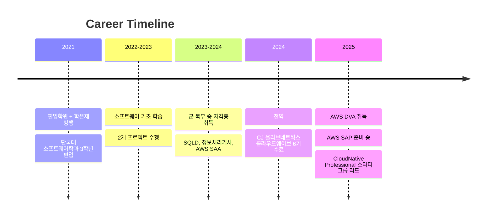

<div align="center">


### 🎓 Software Engineering Student & Cloud Enthusiast

**단국대학교 소프트웨어학과 | Dankook University**

[](your-blog-url)
[](mailto:your-email)

</div>

---

## 👋 About Me

> *"기록하고, 배우고, 성장하는 개발자"*

전적대 없이 **3학년 편입**이라는 도전을 시작으로, 끊임없이 학습하고 기록하며 성장해왔습니다.  
군 복무 중에도 자격증 취득으로 시간을 채웠고, 전역 후에는 클라우드 엔지니어링에 집중하며 **AWS 전문성**을 쌓아가고 있습니다.

- 🚇 **통학 시간**도 책 읽는 시간으로 활용하는 효율형 학습자
- 📝 **기술 블로그**에 학습 내용과 독서록을 꾸준히 기록
- ☁️ **Cloud Native** 기술 스택에 관심이 많으며, 현재 AWS SAP 준비 중
- 💡 **실전 프로젝트**를 통해 이론을 코드로 구현하는 것을 즐김

<br/>

## 🎯 My Journey


<br/>

## 🏆 Certifications

<div align="center">

| Certification | Date | Issuer |
|:---:|:---:|:---:|
| **AWS Solutions Architect - Professional** | *In Progress* 🔥 | AWS |
| **AWS Developer - Associate** | 2024 | AWS |
| **AWS Solutions Architect - Associate** | 2024 | AWS |
| **정보처리기사** | 2024 | 한국산업인력공단 |
| **SQLD** | 2023 | 한국데이터산업진흥원 |

</div>

<br/>

## 💻 Tech Stack

### ☁️ Cloud & DevOps


### 🛠 Development


### 📚 Currently Learning


<br/>

## 📊 GitHub Stats

<div align="center">


</div>

<br/>

## 🌱 Current Focus
```typescript
const currentGoals = {
  certification: "AWS Solutions Architect - Professional",
  study: "Distributed Systems & Design Patterns",
  project: "편의물품 대여 시스템 (React TypeScript)",
  community: "CloudNative Professional 스터디 그룹 리딩",
  habit: "매일 블로그에 학습 내용 기록하기"
};
```

<br/>

## 📝 Latest Blog Posts

<!-- BLOG-POST-LIST:START -->
- 블로그 피드를 자동으로 불러오려면 GitHub Actions 설정이 필요합니다
<!-- BLOG-POST-LIST:END -->

➡️ [더 많은 포스트 보기](your-blog-url)

<br/>

## 💬 Contact & Links

<div align="center">

[](your-blog-url)
[](mailto:your-email)
[](your-linkedin-url)

</div>

---

<div align="center">

### 💡 *"오늘 배운 것을 기록하고, 내일은 한 걸음 더 나아가는 개발자"*


</div>


